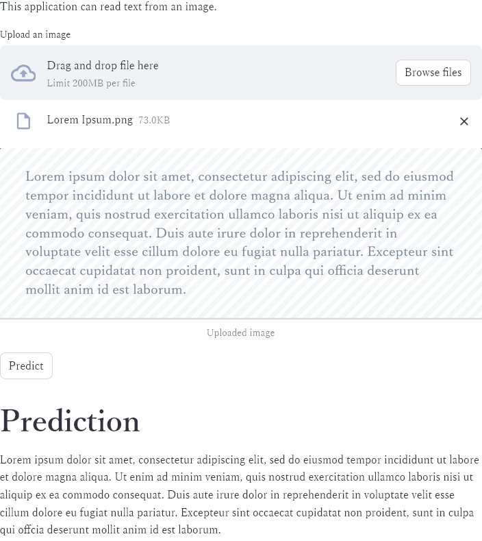

# Azure AI services / Computer Vision / OCR /

### How it works

This is a simple Streamlit app that uses the `Azure Computer Vision API` to perform OCR on an image.
The documentation for the Azure Computer Vision API can be found [here](https://docs.microsoft.com/en-us/azure/cognitive-services/computer-vision/overview-ocr).

The app allows you to upload an image, and then it sends the image to the Azure Computer Vision API to perform OCR.
The app then displays the OCR results.



### How to run the app

- First, on an Azure account, create an Azure AI services multi-service account.
- Then, get the endpoint and subscription key for the Computer Vision API, these can be found under `Resource Management > Keys and Endpoint`.
- Change `<vision_base_url>` and `<subscription_key>` in the `main.py` file to your own Azure Computer Vision API endpoint and subscription key.
- Run the following commands:

```bash
streamlit run main.py
```
- Go to `http://localhost:8501` in your web browser.
- Upload any image file that contains text.
- Click the 'Analyze' button.
- The OCR results will be displayed.
